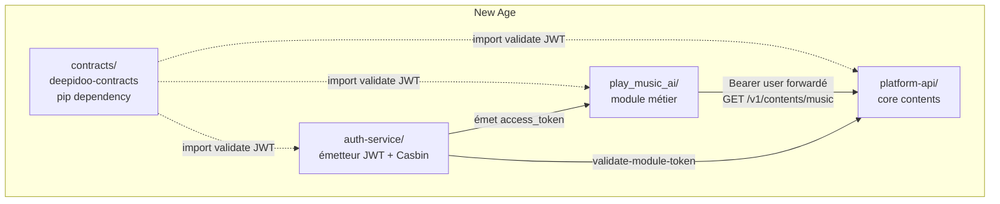
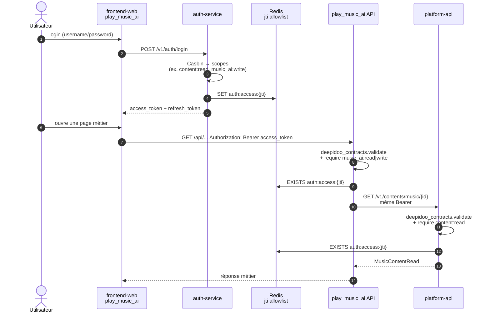
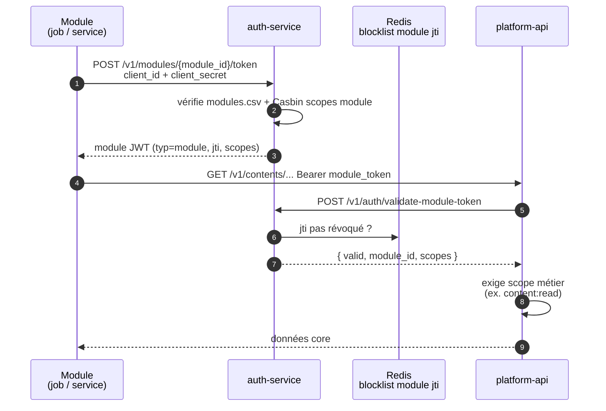

# New Age — contexte global

## Ordre de lecture

1. `contracts` — contrats et modèles partagés.
2. `auth-service` — identités, autorisations et tokens.
3. `platform-api` — cœur produit (orgs, sites, spots, devices, contents).
4. Les modules métier, par exemple `play_music_ai`.

Chaque dépôt conserve son propre cycle de version, ses dépendances, ses tests et son
déploiement. Le fait qu’ils soient ouverts dans le même workspace ne constitue pas un
monorepo.

## Fondation 1 — `contracts`

Package Python `deepidoo-contracts`, publié et versionné indépendamment.

Il porte :

- schémas Pydantic partagés entre APIs ;
- modèles SQLAlchemy des entités centrales ;
- types transverses : références UUID, pagination et erreurs ;
- **validation JWT utilisateur** (`auth.tokens` : decode, claims, jti Redis) ;
- helpers FastAPI Bearer (extra `[auth,fastapi]`).

Les définitions génériques appartiennent à `contracts`. Les schémas propres à un module
restent dans le dépôt du module. Une rupture de compatibilité exige une nouvelle version
majeure.

`contracts` ne tourne pas comme un service en production : il est installé comme dépendance
(`pip install deepidoo-contracts[auth,fastapi]` pour un module API).

Voir [deepidoo-contracts](https://github.com/Deepidoo-s-new-age/deepidoo-contracts).

## Fondation 2 — `auth-service`

Service FastAPI central d’authentification et d’autorisation :

- authentification utilisateur ;
- **émission**, rafraîchissement et révocation des JWT ;
- tokens M2M pour les modules + `validate-module-token` ;
- contrôle des accès avec Casbin.

`auth-service` est l’unique **émetteur** d’identité. La **validation** des JWT utilisateur
est faite localement par chaque service via `deepidoo-contracts` (mêmes `JWT_SECRET` /
`JWT_ISSUER` / Redis jti) — pas de re-copie du decode dans chaque module.

Les données d’authentification résident dans le schéma PostgreSQL `auth`. Les services ne
créent pas de clés étrangères SQL entre leurs bases : les relations inter-services passent
par des UUID.

Voir [auth-service](https://github.com/Deepidoo-s-new-age/auth-service).

## Fondation 3 — `platform-api`

Service FastAPI cœur produit :

- organisations, sites, spots, devices, contents ;
- domaine `core` + schéma PostgreSQL dédié ;
- validation des tokens utilisateur via `deepidoo-contracts` ; tokens module via
`auth-service` (`validate-module-token`) — pas d’émission JWT ici.

Les modules métier lisent les entités core via `platform-api` ; ils ne créent pas de FK
SQL vers d’autres bases.

Voir [platform-api](https://github.com/Deepidoo-s-new-age/platform-api).

## Modules métier

Un module porte une capacité fonctionnelle isolée. Il peut exposer sa propre API, ses
schémas spécifiques et son stockage, mais s’appuie sur les fondations communes :

```text
deepidoo-contracts  (types + validate JWT)
        ↓
auth-service      (émet JWT + Casbin)
        ↓
platform-api
        ↓
modules métier    (import deepidoo-contracts[auth], scopes métier)
```

### `play_music_ai`

Copilote de programmation musicale : catalogue, analyse audio, recommandations, tendances,
génération et gestion de playlists.

Login front → auth-service ; routes module protégées via
`deepidoo_contracts.auth.tokens` + scopes `music_ai:read` / `music_ai:write`.

Voir [play_music_ai](https://github.com/Deepidoo/play_music_ai).

## Règles d’architecture

- Les contrats transverses **et** la validation JWT vont dans `contracts`, pas en duplication
dans les services.
- L’**émission** JWT et les ACL Casbin relèvent de `auth-service`.
- La logique métier reste dans le module concerné.
- Aucun accès direct à la base d’un autre service.
- Aucun secret partagé dans le code ou les fichiers versionnés (`JWT_SECRET` via env).
- Les échanges inter-services utilisent des APIs et des identifiants UUID.
- Une modification d’un contrat partagé doit être versionnée avant son adoption par les
services consommateurs.

## Flux de développement

Pour une évolution transverse :

1. modifier et tester `contracts` si le contrat commun change ;
2. publier/versionner le package ;
3. adapter `auth-service` si l’identité ou les permissions changent ;
4. adapter les modules consommateurs ;
5. tester les contrats et les scopes de bout en bout.

Pour une évolution strictement métier, modifier uniquement le module concerné.

## Conformité implémentation (état actuel)

| Principe | État | Détail |
|---|---|---|
| `contracts` = validation JWT utilisateur (decode, claims, jti Redis) + helpers FastAPI | **OK** | `deepidoo_contracts.auth.tokens` + `auth.fastapi` |
| `auth-service` = seul émetteur JWT (user + module), Casbin, refresh/revoke | **OK** | `/v1/auth/*`, `/v1/modules/{id}/token` |
| Modules / platform-api valident le JWT **utilisateur** via contracts | **OK** | play_music_ai + platform-api |
| Login front → auth-service ; scopes `music_ai:*` sur le module | **OK** | `VITE_AUTH_SERVICE_URL` + `deps.py` |
| Catalogue module → lecture via platform-api (pas de FK SQL croisée) | **OK** | Bearer user forwardé vers `/v1/contents/music` |
| platform-api valide aussi les tokens **module** via `validate-module-token` | **OK** | `get_principal` : user (contracts) ou module (introspection) |
| Token M2M module utilisé pour les appels catalogue (jobs / warmup) | **OK** | play_music_ai : JWT module prioritaire vers platform-api |
| Aucun secret dans le code versionné | **OK** | variables d’environnement uniquement |

En résumé : le chemin **utilisateur** (login → JWT → module → platform-api) est en place.
Le chemin **module M2M** est émis / introspectable côté auth-service, mais platform-api
n’accepte encore que le Bearer utilisateur + scope `content:read`.

## Schémas — architecture des dossiers

```text
New Age                        ← ensemble de dépôts, pas un monorepo de build
├── contracts/                 ← package pip deepidoo-contracts (pas un service)
│   └── src/deepidoo_contracts/
│       ├── auth/
│       │   ├── tokens/        ← encode* / decode / validate / claims / jti Redis
│       │   ├── fastapi/       ← Depends Bearer sync|async + require_any_scope
│       │   ├── schemas/       ← Pydantic auth partagés
│       │   └── models/        ← SQLAlchemy auth partagés
│       ├── core/              ← contents, tracks, artists, playlists…
│       └── common/            ← pagination, erreurs, UUID
│
├── auth-service/              ← seul émetteur d’identité
│   └── app/
│       ├── api/               ← /v1/auth, /v1/modules, /v1/me
│       ├── services/auth/     ← login, refresh, revoke, store jti
│       ├── services/modules/  ← issue + validate-module-token
│       ├── acl/               ← Casbin (policy, modules.csv)
│       └── db/                ← Postgres schéma auth + Redis
│
├── platform-api/              ← cœur produit (contents, orgs…)
│   └── app/
│       ├── api/               ← /v1/contents/music…
│       ├── domains/core/      ← logique métier core
│       ├── core/deps.py       ← validate JWT user (contracts) + content:read
│       └── db/                ← Postgres schéma core + Redis (même jti db)
│
└── play_music_ai/             ← module métier
    ├── backend/app/
    │   ├── api/               ← routes music_ai
    │   ├── core/deps.py       ← validate JWT user + music_ai:* + bind Bearer
    │   └── services/          ← platform_catalog_client (appel platform-api)
    └── frontend-web/          ← login → auth-service en direct
```



## Schémas — authentification utilisateur

Flux actuel :



Points d’alignement obligatoires entre services :

- même `JWT_SECRET` et `JWT_ISSUER` ;
- même base Redis pour la allowlist jti ;
- scopes Casbin : le token user doit porter à la fois `music_ai:*` (module) et
`content:read` (platform-api) s’il forward le Bearer.

## Schémas — authentification module (M2M)

Émission + introspection côté auth-service : **OK**. Consommation platform-api : **cible**,
pas encore câblée.



```text
User JWT                              Module JWT
────────                              ──────────
Émis : POST /v1/auth/login            Émis : POST /v1/modules/{id}/token
Claims : sub, organisation_id,        Claims : typ=module, module_id,
         scopes, jti, exp, iss                 scopes, jti (pas d’exp)
Redis  : allowlist auth:access:       Redis  : blocklist revoked_module_jti
Valide : local via contracts          Valide : introspection auth-service
Usages : browser → module API         Usages : module → platform-api
         (scopes music_ai:*)                   (catalogue, jobs, warmup)
```

## Skills d’équipe (Cursor)

Pour démarrer ou faire évoluer un module, utiliser les workflows dans
[`.cursor/skills/`](../.cursor/skills/README.md) (liste aussi dans le
[README org](../README.md#skills-déquipe)) :

| Besoin | Skill |
|---|---|
| Nouveau module New Age | `/new-module` |
| Projet hors New Age | `/new-project` |
| MAJ du contrat YAML | `/update-module-contract` |
| Review drift YAML ↔ code | `/review-module` |

Les règles d’architecture (`docs/rules/`) restent la référence quotidienne ; les skills
ne les remplacent pas.
